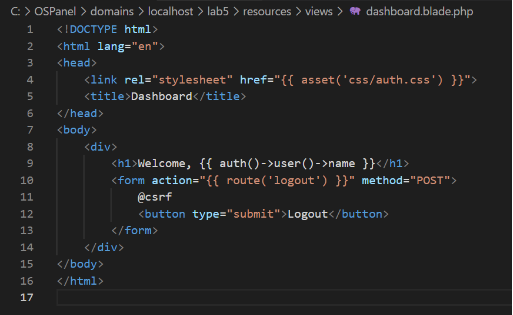

UNIVERSITATEA DE STAT DIN MOLDOVA

FACULTATEA „MATEMATICĂ ŞI INFORMATICĂ”

DEPARTAMENTUL“INFORMATICĂ APLICATA”

Framework

**Lucrarea de laborator nr. 5. Componentele de securitate în Laravel**

`                                `Realizat : Stoian Vladimira

`                                `Grupa: IA2201

`                                `Verificat: Nichita Nartea

Chişinău 2024

**Lucrarea de laborator nr. 5. Componentele de securitate în Laravel**

**Scopul lucrării**

Familiarizarea cu bazele componentelor de securitate în Laravel, cum ar fi **autentificarea**, **autorizarea**, **protecția împotriva CSRF**, precum și utilizarea mecanismelor integrate pentru gestionarea accesului.

Studierea abordărilor dezvoltării sigure, inclusiv crearea rutelor protejate și gestionarea rolurilor utilizatorilor.

**Condiții**

În această lucrare de laborator, veți implementa componentele principale de securitate, precum autentificarea, autorizarea, protecția rutelor și gestionarea de bază a rolurilor. În plus, veți configura mecanismul de resetare a parolei și veți explora logarea acțiunilor utilizatorilor.

Note

Puteți continua munca anterioară sau începe un proiect nou.

**Nr. 1. Pregătirea pentru lucru**

1. Creați un nou proiect Laravel (dacă nu este instalat) sau continuați cu proiectul anterior.

   Pentru aceasta lucrare am creat un proiect complect nou cu numele ‘’lab5’’:

   

   

2. Asigurați-vă că variabilele de mediu din fișierul .env sunt configurate corect, inclusiv conexiunea la baza de date.

   Datele din .env:
   
   

**Nr. 2. Autentificarea utilizatorilor**

1. Creați un controller AuthController pentru gestionarea autentificării utilizatorilor.
2. Adăugați și implementați metodele pentru înregistrarea, autentificarea și deconectarea utilizatorului:
   . register() pentru afișarea formularului de înregistrare.
   . storeRegister() pentru procesarea datelor din formularul de înregistrare.
   . login() pentru afișarea formularului de autentificare.
   . storeLogin() pentru procesarea datelor din formularul de autentificare.
3. Creați rute pentru înregistrarea, autentificarea și deconectarea utilizatorului.
4. Actualizați vizualizările pentru formularele de înregistrare și autentificare.
5. Creați o clasă separată Request pentru validarea datelor de înregistrare sau autentificare sau adăugați validarea direct în controller.
6. Verificați dacă înregistrarea și autentificarea utilizatorului funcționează corect.

   Screen pentru subpunctele de mai sus:
   
   

   

   

**Crearea rutelor** in web.php:

**Crearea vizualizărilor:**

- resources/views/auth/register.blade.php
- resources/views/auth/login.blade.php

**Nr. 3. Autentificarea utilizatorilor cu ajutorul componentelor existente**

Note

Acest pas este opțional și poate fi realizat după partea principală a lucrării.

1. Instalați biblioteca **Laravel Breeze** (sau Fortify, Jetstream) pentru o configurare rapidă a autentificării:
2. php artisan breeze:install
3. npm install && npm run dev

php artisan migrate

4. Urmați instrucțiunile de instalare și configurare a pachetului.
5. Verificați dacă rutele /register, /login, /logout funcționează corect.

**Nr. 4. Autorizarea utilizatorilor**

1. Implementați o pagină „Panou personal”, accesibilă doar utilizatorilor autentificați.
2. Configurați verificarea accesului la această pagină, adăugând middleware-ul auth în rută sau implementând verificarea în controller.
3. Actualizați vizualizarea paginii „Panou personal” pentru a afișa informațiile disponibile exclusiv utilizatorilor autentificați.

Aici urmeaza stilizarea paginei dupa:

**Nr. 5. Rolurile utilizatorilor**

1. Adăugați un sistem de roluri: **Administrator** și **Utilizator**.
2. Configurați comportamentul pentru fiecare rol:
   . **Administrator**: are posibilitatea de a vizualiza panourile personale ale tuturor utilizatorilor.
   . **Utilizator**: poate vizualiza doar propriul panou personal.
3. Implementați verificările rolurilor folosind metoda can, Gate sau middleware, pentru a asigura distribuirea corectă a drepturilor de acces.

In fisierul de migrare adaugam:

**Configurarea rolurilor** in AuthController sau Gate:

**Nr. 6. Deconectarea și protecția împotriva CSRF**

1. Adăugați un buton pentru deconectarea utilizatorului pe pagină.
2. Asigurați protecția împotriva atacurilor CSRF pe formulare.
3. Verificați că deconectarea utilizatorului funcționează corect și sigur.

**Întrebări de control**

**1. Ce soluții integrate pentru autentificare oferă Laravel?**

Laravel oferă mai multe soluții integrate pentru autentificare, care ajută la gestionarea securității utilizatorilor și a sesiunilor. Iată câteva dintre cele mai comune soluții integrate în Laravel:

- **Laravel Breeze**: Este o soluție simplă și ușor de configurat pentru autentificare, care include rutele, vizualizările și logica de autentificare pentru login, înregistrare și resetarea parolei. Este ideală pentru aplicațiile mici sau când vrei să începi rapid.
- **Laravel Jetstream**: Oferă un sistem mai avansat de autentificare, care include gestionarea sesiunilor, autentificarea pe două niveluri (2FA), recuperarea parolei, și multe altele. Jetstream este recomandat pentru aplicațiile care necesită funcționalități de autentificare mai complexe.
- **Laravel Fortify**: Este o bibliotecă care oferă doar backend-ul pentru autentificare și securitate, fără a include vizualizări sau interfețe. Este ideal dacă dorești să construiești propriile vizualizări și să controlezi mai mult designul aplicației.
- **Socialite**: Permite autentificarea utilizatorilor prin conturi externe (Google, Facebook, GitHub etc.), adică autentificare prin terți. Este o soluție utilă pentru a facilita accesul utilizatorilor care deja au un cont pe alte platforme.

Fiecare dintre aceste soluții oferă rute și metode de autentificare standard pentru a ușura implementarea autentificării într-o aplicație Laravel.

**2. Ce metode de autentificare a utilizatorilor cunoașteți?**

Există mai multe metode prin care utilizatorii pot fi autentificați într-o aplicație, iar Laravel le suportă pe majoritatea. Cele mai comune metode de autentificare sunt:

- **Autentificare tradițională cu email și parolă**: Aceasta este cea mai frecvent utilizată metodă, unde utilizatorii își creează un cont cu un email și o parolă. Laravel include rute și metode pentru înregistrare, login și logout prin această metodă.
- **Autentificare pe două niveluri (2FA)**: Oferă un nivel suplimentar de securitate prin cerința unui cod de autentificare care este trimis pe email sau printr-o aplicație de tip autentificator (ex. Google Authenticator). Laravel Jetstream susține această metodă de autentificare.
- **Autentificare prin terți (Socialite)**: Permite autentificarea utilizatorilor prin conturi externe precum Google, Facebook, Twitter, GitHub și altele. Laravel Socialite este folosit pentru a integra aceste metode de autentificare.
- **Autentificare prin API (Token-based)**: Folosită pentru aplicațiile care comunică cu un backend prin API. Utilizatorii sunt autentificați folosind un token de acces (JWT, OAuth, Passport). Laravel Passport oferă o implementare completă a autentificării API cu OAuth2.
- **Autentificare prin SMS**: În loc de o parolă, utilizatorii primesc un cod temporar prin SMS. Deși Laravel nu include o soluție nativă pentru aceasta, pot fi folosite pachete externe pentru implementarea autentificării SMS.

**3. Care este diferența dintre autentificare și autorizare?**

- **Autentificare** (Authentication): Este procesul prin care un sistem confirmă identitatea unui utilizator. Adică, autentificarea este verificarea faptului că utilizatorul care se conectează este cine spune că este. De obicei, autentificarea se face printr-un nume de utilizator (de exemplu, un email) și o parolă. Dacă aceste informații sunt corecte, utilizatorul este autentificat și i se oferă acces la aplicație.

Exemple de autentificare:

- Login cu email și parolă.
- Autentificare cu Google sau Facebook.
- **Autorizare** (Authorization): Este procesul prin care un sistem determină ce resurse sau acțiuni sunt permise unui utilizator autenticat. După ce utilizatorul a fost autentificat, autorizarea determină ce poate face acel utilizator în aplicație, în funcție de rolurile și permisiunile atribuite. De exemplu, un utilizator cu rol de "administrator" poate gestiona alți utilizatori, în timp ce un "utilizator obișnuit" poate doar să vizualizeze conținutul.

Exemple de autorizare:

- Permisiuni pentru a vizualiza sau edita un anumit tip de date (de exemplu, doar admini pot șterge articole).
- Roluri de utilizatori (admin, editor, utilizator).

**4. Cum se asigură protecția împotriva atacurilor CSRF în Laravel?**

**CSRF** (Cross-Site Request Forgery) este un tip de atac în care un utilizator autenticat este înșelat să execute acțiuni neautorizate pe un site web. Laravel protejează automat aplicațiile sale împotriva atacurilor CSRF printr-o serie de măsuri de securitate:

- **Middleware CSRF**: Laravel include un middleware care se asigură că toate cererile POST, PUT, PATCH și DELETE sunt protejate împotriva atacurilor CSRF. Acest middleware verifică dacă cererea are un token CSRF valid.
- **Token CSRF**: Laravel generează un token unic pentru fiecare sesiune a utilizatorului și îl include în fiecare formulare HTML sau cerere AJAX. Acest token trebuie trimis în cererea de formă (ca un parametru ascuns în formular sau în headerul cererii AJAX) pentru a fi validată. Dacă token-ul nu corespunde sau lipsește, cererea este respinsă ca fiind potențial periculoasă.

De exemplu, pentru a proteja un formular HTML împotriva atacurilor CSRF, adaugi direct în formularele tale:

<form method="POST" action="{{ route('some.route') }}">

`    `@csrf

`    `<button type="submit">Trimite</button>

</form>

Aici @csrf generează automat un câmp ascuns în formular care conține token-ul CSRF.

- **Excepții pentru rutele externe**: Laravel va aplica protecția CSRF doar pe rutele care se află în middleware-ul web. Pentru rutele API, de obicei, se utilizează autentificare bazată pe token și nu este necesară protecția CSRF.

Prin urmare, protecția CSRF în Laravel este gestionată automat pentru majoritatea formularelor și cererilor POST, iar dezvoltatorii nu trebuie să se preocupe de implementarea manuală a acestei protecții.

